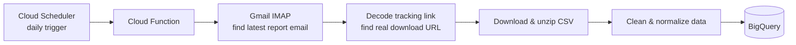

# WebEngage → Gmail → BigQuery Pipeline

Automated daily ELT pipeline that eliminates a manual reporting step: instead of someone logging into email, finding the scheduled WebEngage report, downloading it, and uploading it to BigQuery by hand, this runs on its own every day.

## What it does

1. **Reads Gmail** via IMAP to find the latest WebEngage scheduled report email (matched by sender + subject filters)
2. **Extracts the real download link** — WebEngage wraps the actual report URL inside a base64-encoded tracking link, so the script decodes it to find the true destination instead of trusting the outer domain
3. **Downloads and unzips** the report (handles both raw CSV and zipped CSV)
4. **Cleans the data** — normalizes column names, parses dates, and auto-detects percentage columns by content (not by column name, to avoid mangling unrelated text fields)
5. **Loads to BigQuery** — appends daily rows to a history table (or replaces, if configured)

Runs as a Google Cloud Function, triggered daily by Google Cloud Scheduler.

## Architecture



## Stack

`Python` · `Google Cloud Functions` · `Google Cloud Scheduler` · `Gmail IMAP` · `pandas` · `BigQuery`

## Setup

1. Create a Gmail [App Password](https://myaccount.google.com/apppasswords) (not your normal password) for IMAP access
2. Create a BigQuery service account with load permissions, download its JSON key
3. Fill in `CONFIG` in `main.py` with your Gmail address/app password, sender/subject filters, and BigQuery project/dataset/table
4. Deploy as an HTTP-triggered Cloud Function:
    gcloud functions deploy webengage-pipeline
```
--runtime python311
--trigger-http
--entry-point run_pipeline
```
5. Create a Cloud Scheduler job to hit the function's URL daily

## Notes

- `write_mode: "append"` keeps a full daily history; `"replace"` overwrites the table each run
- Credentials are never committed — `CONFIG` values are placeholders; use environment variables or Secret Manager in production
