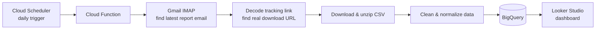

# WebEngage → Gmail → BigQuery → Looker Studio

Automated daily pipeline that replaces a manual reporting routine. Instead of someone opening email, finding the WebEngage scheduled report, downloading it, and uploading it to BigQuery by hand, this runs on its own every day and feeds a live Looker Studio dashboard.

## Overview



## What the code does

1. **Finds the email**: logs into Gmail via IMAP and grabs the latest WebEngage report email (filtered by sender and subject).
2. **Finds the real download link**: WebEngage hides the actual report URL inside a base64-encoded tracking link, so the script decodes each link to find the true destination.
3. **Downloads the report**: handles both raw CSV and zipped CSV.
4. **Cleans the data**: standardizes column names, parses dates, converts percentage columns to numbers (detected by content, not column name), and adds an `ingested_at` timestamp.
5. **Loads to BigQuery**: appends each day's rows to a history table (or replaces the table, if configured).

## Dashboard

BigQuery is connected to Looker Studio as the data source, so the dashboard updates automatically after each daily load.

- **Data source:** BigQuery table 
- **Screenshot:** https://github.com/AsimIqbal0300/Webengage-Automated_ETL_Pipeline/blob/cf08b5b5211fb301ac757ad4e5937bdfc5bc359e/use%20this%20fo%20uplaod.png

## Stack

`Python` · `Google Cloud Functions` · `Google Cloud Scheduler` · `Gmail IMAP` · `pandas` · `BigQuery` · `Looker Studio`

## Setup

1. Create a Gmail [App Password](https://myaccount.google.com/apppasswords) (not your normal password) for IMAP access.
2. Create a BigQuery service account with load permissions and download its JSON key.
3. Fill in `CONFIG` in `main.py`: Gmail address/app password, sender/subject filters, BigQuery project/dataset/table.
4. Deploy as an HTTP-triggered Cloud Function:

   ```bash
   gcloud functions deploy webengage-pipeline \
     --runtime python311 \
     --trigger-http \
     --entry-point run_pipeline
   ```

5. Create a Cloud Scheduler job to hit the function's URL daily.
6. In Looker Studio, add the BigQuery table as a data source and build/connect your dashboard.

## Requirements

```
functions-framework==3.*
pandas
requests
google-cloud-bigquery
google-auth
```

## Notes

- `write_mode: "append"` keeps a full daily history; `"replace"` overwrites the table each run.
- Credentials are never committed. `CONFIG` values are placeholders; use environment variables or Secret Manager in production.
